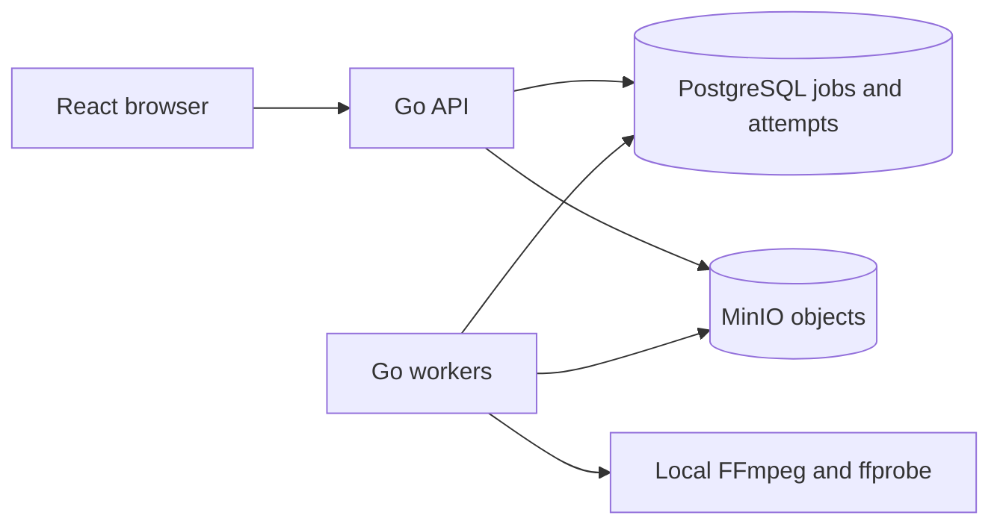

# ClipFlow

A local video-processing workspace built with Go, PostgreSQL, MinIO, FFmpeg, React and TypeScript. Upload a short MP4 and get a JPEG thumbnail, an H.264/AAC preview up to 480 pixels high, real metadata and a visible attempt history.

## Public walkthrough

**[Explore ClipFlow in your browser](https://waynessed.github.io/Clip-Flow/)**

The public walkthrough plays real synthetic inputs and generated previews,
shows recorded processing/recovery attempts, and links to implementation and
verification evidence. It is read-only: the examples are recorded runs from
29 September 2026, and selecting one does not submit a job. Uploads and workers
remain in the local application below.

GitHub Pages serves a separate static build over HTTPS. Deployment status is
available in the [Public walkthrough workflow](https://github.com/Waynessed/Clip-Flow/actions/workflows/pages.yml).
See [public walkthrough operations](docs/public-walkthrough.md) for build,
verification, media provenance and publishing instructions.

## Start the demo

Requirements: Docker Desktop running Linux containers and PowerShell. The first build needs internet; Go, FFmpeg and Node for the app are inside containers. Node 24 is needed on the host only to run Playwright and benchmarks.

```powershell
./scripts/bootstrap.ps1
./scripts/demo.ps1 -SkipBootstrap
```

Open [localhost:5173](http://localhost:5173). Select `.artifacts/demo.mp4` or an MP4 up to 20 MiB / 30 seconds, then click **Process clip**. Keep the request key to repeat the same upload safely. View the preview, JPEG, metadata and processing history. API: [localhost:8080](http://localhost:8080). PostgreSQL and MinIO have no exposed host ports. Local credentials in Compose are for this demo workspace.

The first build compiles the pinned MinIO release from source because the public image registries refused access. That source step took about eight minutes here; subsequent builds reuse the layer. Exact runtime/dependency versions and all observed failures are in the implementation log.

## Demonstrate recovery

```powershell
./scripts/demo.ps1 -SkipBootstrap -Recovery -Stale
node scripts/reliability.mjs
```

The first command uploads real media, verifies duplicate identity, kills a processing container, observes another worker recover its expired attempt, then demonstrates an obsolete worker completing but being rejected at publication. Recovery containers use an eight-second lease; normal workers use 60 seconds with ten-second renewal. The second command demonstrates actual API/worker restarts and a real MinIO outage, restoring services afterward. Run these demos one at a time on an idle local workspace: they intentionally stop services.

## Verification and benchmarks

```powershell
./scripts/test.ps1
./scripts/benchmark.ps1
```

Go tests use real PostgreSQL, MinIO and FFmpeg in isolated schemas/buckets. Coverage includes sequential/concurrent duplicates, conflicting content, upload bounds, exclusive claims, retries, expired-attempt limits, stale publication, heartbeat cancellation, output metadata and cleanup preservation. Playwright uploads through the browser and plays the produced MP4. CI runs Compose, Go tests/vet and the browser smoke test; remote execution status is recorded separately from local results.

The benchmark uses 100 distinct synthetic clips per run and three repetitions each with one, two and four workers. Worker limits are one CPU and 512 MiB. Every run retains raw results and resource samples under `docs/benchmarks/`; [benchmark report](docs/benchmark-report.md) records measured results and limitations after execution.

## Architecture and guarantees



Uploads stream to bounded temporary files before validation. Jobs are acknowledged after durable database insertion. Workers claim rows in short SKIP LOCKED transactions, renew leases using database time, write outputs under unique attempt prefixes, and conditionally publish one visible manifest. The API proxies only published objects.

**Execution may repeat after failures. Only the current valid attempt can publish the visible result.** Object storage and PostgreSQL do not share a transaction; orphan objects can remain until explicit cleanup. This is not exactly-once processing.

## Operations

```powershell
# Stop while retaining data
 docker --context desktop-linux compose down
# Explicit cleanup of unreferenced objects older than 24 hours
 docker --context desktop-linux compose run --rm --entrypoint cleanup tools
# Intentionally discard this local demo's database and objects
 docker --context desktop-linux compose down -v
```

Endpoints: `POST /v1/jobs`, `GET /v1/jobs`, `GET /v1/jobs/{id}`, `GET /v1/jobs/{id}/outputs/{kind}`, `/healthz`, `/readyz`, `/metrics`. [OpenAPI](docs/openapi.yaml) describes the contract.

## Learn from the actual implementation

- [Current state](docs/current-state.md): verified behaviour, revisions, next work and commands.
- [Implementation log](docs/implementation-log.md): CF stages, code changes, commands, observed results and deviations.
- [Walkthrough](docs/walkthrough.md): actual functions and data/control flow.
- [Decisions](docs/decisions.md): queue, consistency, ownership, retries and benchmark choices.
- [Demo guide](docs/demo.md): exact startup, recovery and troubleshooting steps.
- [Evidence](docs/evidence): real responses, logs, tests and screenshot.

For a later explanation of a stage, read its log entry, recorded Git revision, code and tests. Earlier checkpoints remain in Git history so explanations can distinguish the original implementation from later corrections.
