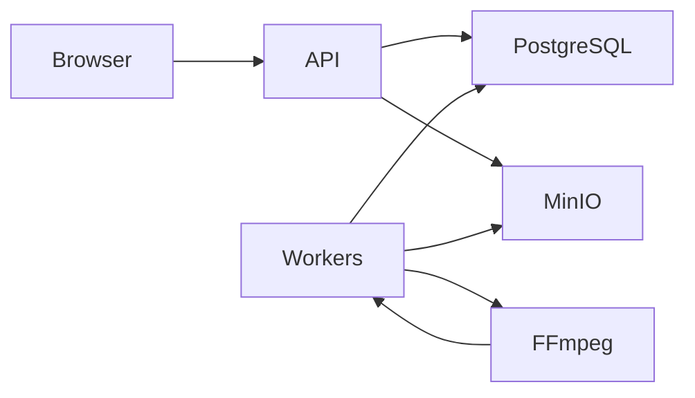

# ClipFlow

A local video-processing workspace using Go, PostgreSQL, MinIO, FFmpeg and React. Upload MP4 files up to 20 MB / 30 seconds and receive a JPEG, a 480p H.264 preview and metadata.

```powershell
./scripts/bootstrap.ps1
./scripts/demo.ps1 -SkipBootstrap
```

Open http://localhost:5173. Requires Docker Desktop with Linux containers. Current verification status: [docs/current-state.md](docs/current-state.md).



Execution may repeat after failures. Only the current unexpired attempt can publish the visible result. See [walkthrough](docs/walkthrough.md), [implementation log](docs/implementation-log.md), [decisions](docs/decisions.md) and [demo](docs/demo.md).
